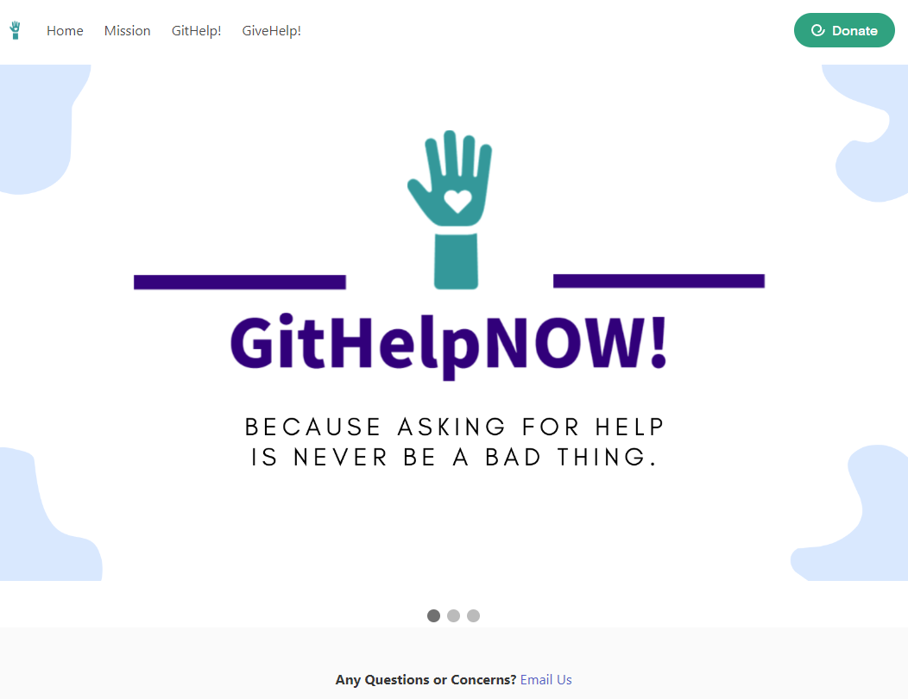

# GitHelpNOW

# About Us

GitHelpNOW! is committed to serving the community through our application. Established in 2022 by a group of four software development students, our primary goal was to create an online environment that promotes inclusivity and makes community resources more accessible to the public.

Further, we at GitHelpNOW! believe that access to community resources should be more approachable and that no one should feel discouraged when asking for help. We recognize that there are dismissive stigmas surrounding reliance on community resources, and our hope with GitHelpNOW! is to eliminate this negative culture. It takes great strength to ask for help, and we want every user to feel safe and humanized in their moment of need.

# Mission

Our Mission here at GitHelpNOW! is to make community resources more accessible and reduce negative stigmas surrounding the utilization of said resources.

## Preview

# Features:

Main Page

1. Top Navigation Bar with the following options: Home, Mission, GitHelp and GiveHelp.

2. Donate button - features a selected non-profit organization. The user can select or enter the amount desired and a new window will be opened so the donation can be finalized.

## Person in Need - GitHelp!:

1. GitHelp! - opens a page that contains a map and categories to be selected.

2. The map is initiated with the User's current location. The coordinates are identified and stored for future reference.

3. Once the user selects a category the locations are displayed in the map.

4. When a different category is selected, then a new search occurs and the locations from this new search is displayed on the map.

## Person that wants to help - GiveHelp!:

1. GiveHelp! - opens a page that contains a drop-down menu with the following categories: shelters, foodbanks, women's shelter and mental health facilities.
2. Once the user selects a category then a list with non-profit organizations is populated using the Every.org Charity API.
3. Once the user selects a different category than a list referencing organizations of that category is displayed.
4. Every organization contains a button "visit" so the user can visit the organizations' donation page and have access to more information about the organization.

## APIs:

 - Google Maps API - "The Maps JavaScript API lets you customize maps with your own content and imagery for display on web pages and mobile devices" (Google Maps Platform, at: https://developers.google.com/maps/documentation/javascript/overview)
 - Google Places API -  "The Places API is a service that returns information about places using HTTP requests. Places are defined within this API as establishments, geographic locations, or prominent points of interest." (Google Maps Platform, at: https://developers.google.com/maps/documentation/javascript/overview)
 - Every.org Charity API Docs - nonprofit search API: access search to over 1 million nonprofit organizations, enabling to get information and a donation link for each one.
https://docs.every.org/docs/nonprofit-search

